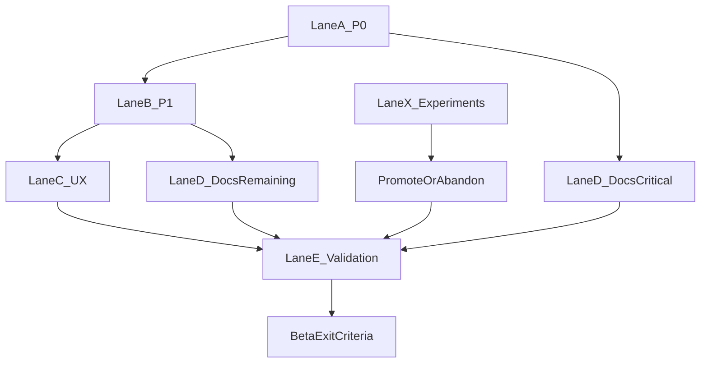

# Beta Execution Strategy (Systemic Operating Plan)

This document is the execution system for getting `git-fire` to beta safely and predictably.
It translates findings into lanes, gates, ownership, and escalation rules that can be run daily.

## Mission

- Ship beta with no unresolved P0 safety/correctness risk.
- Keep decisions explicit and traceable to implementation.
- Preserve velocity without allowing uncontrolled scope growth.
- Keep experiments non-blocking unless they are promoted by clear evidence.

## Primary Sources

- Readiness and priorities: `BETA_READINESS_REPORT.md`
- Finding IDs and evidence baseline: `BETA_BLOCKERS_PROGRESS.md`
- Deferred/post-beta backlog and decisions: `ROADMAP.md`
- Parallel execution SOP: `KTLO_PARALLEL_EXECUTION_PLAYBOOK.md`

## Branch Model and Governance

### Primary Beta Integration Branch

- **Primary branch for beta work:** `feature/path_to_beta`
- All beta-critical merges land here first.
- Merge to `main` only after beta exit criteria pass.

### Supporting Branches

- Use short-lived scoped branches off `feature/path_to_beta` for each workstream slice.
- Use disposable experiment branches for risky architecture alternatives.
- Keep branch naming explicit by stream:
  - `fix/beta-p0-*`
  - `fix/beta-p1-*`
  - `fix/beta-ux-*`
  - `docs/beta-*`
  - `exp/*` for non-blocking experiments

### PR Rules

- One PR should close one coherent risk slice.
- Every agent branch opens a PR back into `feature/path_to_beta` (never directly to `main`).
- Each PR is reviewed independently and merged independently.
- PR description must include:
  - Finding IDs addressed
  - Tests run
  - Residual risk (if any)
  - Rollback notes for git-operation changes
- No broad multi-lane PRs unless required by dependency coupling.

## Beta Exit Criteria (Hard Gate)

Beta is ready only when all conditions hold:

1. P0 items are resolved with tests and reviewed behavior evidence.
2. CRITICAL doc mismatches are resolved and validated against current CLI/config behavior.
3. Decision outcomes are implemented or explicitly deferred with rationale in `ROADMAP.md`.
4. No active blocker in any lane is marked unknown/untested.
5. `feature/path_to_beta` is stable and reproducible under verification commands.

## Execution System (Lanes)

| Lane | Scope | Inputs | Blocking | Output |
|---|---|---|---|---|
| Lane A | P0 safety/correctness | P0 items from readiness + blockers docs | Yes | Merged P0 fixes + tests |
| Lane B | P1 safety/correctness | P1 items from readiness + blockers docs | Yes (for beta confidence) | Merged P1 fixes + tests |
| Lane C | UX followups | WK issues and low-risk UX defects | Conditional | UX fixes with no core behavior drift |
| Lane D | Docs reality alignment | D-series mismatches | Yes for CRITICAL, then HIGH/MED/LOW | Accurate shipped docs |
| Lane E | Validation hardening | test/race/lint + targeted behavior checks | Yes | Verifiable release baseline |
| Lane X | Experiments | optional risky alternatives | No | decision memo: adopt or abandon |

## Multi-Agent Decomposition Model

Use one agent per coherent change bundle so each agent can run independently with minimal merge friction.

| Agent Bundle | Scope | Typical Files | Dependency |
|---|---|---|---|
| Agent A (P0 Core Safety) | P0-1/P0-2/P0-3 behavior and guardrails | `internal/git/*`, `internal/executor/*`, `cmd/root.go` | Starts first |
| Agent B (P1 Safety/Correctness) | P1 defect fixes and targeted tests | `internal/*`, `cmd/*`, related `_test.go` files | Starts after Agent A touchpoints stabilize |
| Agent C (UX Followups) | WK fixes with low core risk | `internal/ui/*` | Can run in parallel with Agent B where no shared files |
| Agent D (Docs Critical) | D-01 through D-04 alignment | `GIT_FIRE_SPEC.md`, `README.md`, docs | Requires Agent A behavior finalized |
| Agent E (Docs Remaining) | D-05+ alignment and cleanup | specs/docs set | Starts after Agent B/C outcomes are known |
| Agent V (Validation) | verification and evidence capture | CI/test scripts, validation artifacts | Runs continuously and at phase gates |
| Agent X (Experiments) | optional alternatives (non-blocking) | isolated `exp/*` branches | Never blocks beta lanes |

### Agent Branch Protocol

- Branch naming: `agent/<bundle>-<topic>` off `feature/path_to_beta`.
- One bundle per agent branch; no cross-bundle mixed PRs.
- Rebase or merge from `feature/path_to_beta` at least once daily for long-running bundles.
- Agent PR target branch must be `feature/path_to_beta`.
- Agent PR must include finding IDs, validation commands, and rollback notes where applicable.

### Agent Handoff Contract

Every agent handoff must include:

1. What changed and why (with finding IDs).
2. Commands run and outcomes.
3. Remaining risks or blockers.
4. Recommended next agent or lane.

### Agent Scheduling Rules

- Prioritize Agent A and Agent D first because they gate beta safety and trust.
- Run Agent B and Agent C in parallel only when file ownership is non-overlapping.
- Keep Agent E queued until runtime behavior is stable.
- Keep Agent V independent and always-on as gate verifier.
- Use Agent X only for explicitly approved experiments with a time-box.

## Dependency and Promotion Flow

## Work Intake and Tracking Contract

Every task entering execution must include all fields below.

| Field | Requirement |
|---|---|
| Task ID | `BETA-<lane>-<seq>` (example: `BETA-P0-01`) |
| Finding Mapping | One or more IDs from `BETA_BLOCKERS_PROGRESS.md` / readiness report |
| Owner | Single accountable person |
| Branch | Working branch name |
| Status | `todo`, `in_progress`, `blocked`, `ready_for_review`, `done` |
| Validation | Exact commands and expected outcomes |
| Evidence | PR link, commit(s), and notes for behavior verification |
| Risk Tag | `safety`, `correctness`, `ux`, `docs`, or `experiment` |
| Rollback Note | Required for git-operation or config-write changes |

Rules:

- No task executes without finding mapping and validation commands.
- No task can be marked done without merged evidence and verification notes.
- Blocked tasks require explicit unblock action and owner.
- Descoped tasks must record rationale and destination (`ROADMAP.md` or archive note).

## Phase Plan with Entry/Exit Gates

### Phase 1: P0 + CRITICAL Docs

**Entry**
- P0 and CRITICAL items are enumerated and assigned.
- Branches created from `feature/path_to_beta`.

**Execution**
- Resolve P0-1, P0-2, P0-3 class defects first.
- Implement decided policy behavior (`--backup-to`, `--fire --dry-run`, prompt posture).
- Resolve D-01 through D-04 with code-accurate docs.

**Exit Gate**
- All P0 tasks merged with tests.
- CRITICAL docs aligned to current behavior.
- Validation commands pass for touched areas + race/lint baseline.

### Phase 2: P1 Safety/Correctness

**Entry**
- Phase 1 complete with no regressions.

**Execution**
- Ship P1 fixes in narrow, test-backed slices.
- Avoid mixed refactor + behavior changes unless necessary.

**Exit Gate**
- All in-scope P1 items merged or explicitly deferred with rationale.
- No regressions in dry-run, conflict handling, or commit safety flows.

### Phase 3: UX Followups

**Entry**
- Core safety and correctness flows are stable.

**Execution**
- Apply low-risk UX fixes that do not alter core backup semantics.
- Push redesign-heavy alternatives to experiment lane or post-beta backlog.

**Exit Gate**
- UX defects fixed with deterministic behavior and no core regressions.

### Phase 4: Remaining Docs Alignment

**Entry**
- Runtime behavior is stable enough for documentation lock-in.

**Execution**
- Resolve HIGH/MEDIUM/LOW mismatches after code stabilization.
- Keep future/non-shipped ideas explicitly marked as deferred.

**Exit Gate**
- No known docs-vs-code mismatch in user-facing command/config docs.

### Phase 5: Validation and Release Hardening

**Entry**
- Core lanes complete and doc alignment stable.

**Execution**
- Run full verification set and targeted regression checks.
- Record evidence bundle for release decision.

**Exit Gate**
- All required validation commands pass.
- Beta release recommendation is evidence-backed and reproducible.

## Required Validation Evidence

For each phase PR or merge set, capture:

- Targeted package tests for changed areas.
- `make test-race`.
- `make lint`.
- Manual behavior checks for changed CLI paths (when code path is user-facing).

Suggested report format per merge:

1. What changed (IDs and files)
2. Commands run
3. Result summary
4. Residual risk and follow-up

## Cadence and Reporting

- **Daily execution sync**: lane status, blocked items, decisions needed.
- **Twice-weekly risk review**: check if any lane should pivot or split.
- **Phase closeout review**: evidence review against exit gate before promotion.

Status outputs should always include:

- Completed since last report
- In progress now
- Blocked with owner/action
- Next 24-hour target

## Risk Controls for Repo-Mutation Changes

- Require rollback notes for `internal/git/*`, planner, and config write paths.
- Keep safety-sensitive changes small and isolated.
- Prefer behavior-preserving refactors with tests over broad rewrites.
- Do not merge speculative behavior changes without reproducible evidence.

## Pivot Protocol (Way Out)

When execution becomes unstable or too costly, use this pivot flow.

### Pivot Triggers (Objective)

Trigger pivot if any condition occurs:

1. Same lane fails its exit gate twice in a row.
2. Two rollbacks are required in one phase.
3. A change introduces repeat regressions in safety/correctness paths after fix attempts.
4. Scope growth adds more than 30% new work to a lane without corresponding risk reduction.
5. Review/validation churn indicates design thrash (three redesign iterations with no mergeable slice).

### Pivot Steps

1. **Stop**: freeze new scope in affected lane.
2. **Assess**: capture failure pattern, constraints, and options in a short decision note.
3. **Split**: move risky path to `exp/*` branch or defer to `ROADMAP.md`.
4. **Resume**: continue with lowest-risk alternative that still satisfies beta gates.
5. **Record**: link pivot rationale in PR and blockers/roadmap tracking.

### Pivot Guardrail

Do not pivot by abandoning safety-critical fixes; pivot only the implementation approach.

## Single-Source Boundaries

- `BETA_EXECUTION_STRATEGY.md`: how work is executed now (lanes, gates, cadence, pivot protocol).
- `BETA_BLOCKERS_PROGRESS.md`: canonical finding IDs and evidence baseline.
- `BETA_READINESS_REPORT.md`: prioritized risk assessment and release-readiness framing.
- `ROADMAP.md`: deferred, experimental, and post-beta items only.

If an item is not in active beta scope, it must move to `ROADMAP.md` with explicit rationale.

## Immediate Next Actions

1. Assign named owners to Agent A/B/C/D/E/V/X bundles.
2. Create first `agent/*` branches from `feature/path_to_beta` with finding-ID scoped tasks.
3. Require each agent branch to open an independent PR into `feature/path_to_beta`.
4. Start Agent A and Agent D immediately, then parallelize Agent B/C as file overlap allows.
5. Run Agent V verification at each merge into `feature/path_to_beta`.
