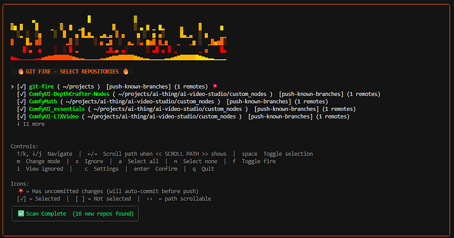

# Git Fire - Multi-Repo Checkpoint CLI

<p align="center">
  
  
</p>

<p align="center">
  
  
  
  
  <a href="https://discord.gg/pjkVMSpT7j"></a>
</p>

> In case of fire:
> 1. `git-fire`
> 2. Leave building

`git-fire` is one command to checkpoint many repositories: discover, auto-commit dirty work (optional), and push backup branches/remotes with safety rails.

Manual push loops fail more often than we admit (network drops, auth hiccups, shell mistakes). `git-fire` provides an auditable recovery path when you need one consistent move across many repos.

Invocation note: `git-fire` and `git fire` are equivalent when `git-fire` is on your PATH.

*Maintainer note: this project is built for high-stress moments and everyday discipline. Keep it simple, keep it safe, keep moving.*

## Table of Contents

- [Beta Status](#beta-status)
- [Quick Start](#quick-start)
  - [First run](#first-run)
  - [One-line emergency mode](#one-line-emergency-mode)
- [Install](#install)
  - [Homebrew (macOS/Linuxbrew)](#homebrew-macoslinuxbrew)
  - [WinGet (Windows)](#winget-windows)
  - [Linux quick install script](#linux-quick-install-script)
  - [Linux native packages (`.deb` / `.rpm`)](#linux-native-packages-deb--rpm)
  - [Go install](#go-install)
  - [Binary archive (manual)](#binary-archive-manual)
  - [PATH setup (required)](#path-setup-required)
  - [Verify install](#verify-install)
  - [Build from source](#build-from-source)
- [Who Is This For](#who-is-this-for)
- [Use Cases](#use-cases)
- [Key Features](#key-features)
- [Core Commands](#core-commands)
- [Configuration and Behaviors](#configuration-and-behaviors)
- [TUI](#tui)
  - [TUI screenshot](#tui-screenshot)
  - [TUI color profiles](#tui-color-profiles)
- [Release Roadmap](#release-roadmap)
- [Documentation](#documentation)
- [Security Notes](#security-notes)
- [Security Policy](#security-policy)
- [Contributing](#contributing)
- [License](#license)

## Beta Status

`git-fire` is beta software. Core multi-repo backup flows are usable today. A few roadmap items are intentionally not wired yet (`--backup-to`, default plugin CLI auto-loading, and USB destination mode).

## Project Snapshot

- **Project:** `git-fire` (`github.com/git-fire/git-fire`)
- **Language:** Go 1.24.2
- **License:** MIT
- **Status:** Beta
- **Core promise:** one command to discover repos, auto-commit dirty work (unless disabled), and push backups so local-only work is not lost

Detailed product, architecture, safety, testing, and roadmap notes are in [docs/PROJECT_OVERVIEW.md](docs/PROJECT_OVERVIEW.md).

## Quick Start

### First run

```bash
# preview first (safe)
git-fire --dry-run --path ~/projects

# run default streamed checkpoint
git-fire
```

### One-line emergency mode

> Emergency bootstrap script path is established; package-manager installs are still coming soon.

Use this for urgent situations only. `curl | bash` executes remote code directly.
Inspect `scripts/emergency.sh` first and prefer release assets plus checksums when you have time.

```bash
# replace v0.1.0-beta with the release tag you want to run
curl -fsSL https://raw.githubusercontent.com/git-fire/git-fire/v0.1.0-beta/scripts/emergency.sh | bash
```

## Install

| Method | Command | Platform |
|---|---|---|
| Homebrew | `brew install git-fire/tap/git-fire` | macOS, Linuxbrew |
| WinGet | `winget install git-fire.git-fire` | Windows |
| Linux install script | `curl -fsSL https://raw.githubusercontent.com/git-fire/git-fire/main/scripts/install.sh \| bash` | Linux |
| Linux package | Download `.deb` or `.rpm` from [GitHub Releases](https://github.com/git-fire/git-fire/releases) | Linux |
| Go | `go install github.com/git-fire/git-fire@latest` | All (Go 1.24.2+) |
| Binary archive | [GitHub Releases](https://github.com/git-fire/git-fire/releases) | All |

Package-manager channels are published for stable tags (`vX.Y.Z`).
Prerelease tags (`-alpha`, `-beta`, `-rc`) always ship release binaries.

Maintainer runbooks:
- Homebrew: [`docs/HOMEBREW_RELEASE_RUNBOOK.md`](docs/HOMEBREW_RELEASE_RUNBOOK.md)
- WinGet: [`docs/WINGET_RELEASE_RUNBOOK.md`](docs/WINGET_RELEASE_RUNBOOK.md)
- Release checklist: [`docs/RELEASE_CHECKLIST.md`](docs/RELEASE_CHECKLIST.md)

### Homebrew (macOS/Linuxbrew)

```bash
brew tap git-fire/tap
brew install git-fire
```

### WinGet (Windows)

```powershell
winget install git-fire.git-fire
```

### Linux quick install script

```bash
curl -fsSL https://raw.githubusercontent.com/git-fire/git-fire/main/scripts/install.sh | bash
```

Optional environment overrides:

```bash
curl -fsSL https://raw.githubusercontent.com/git-fire/git-fire/main/scripts/install.sh | \
  VERSION=v0.2.0 INSTALL_DIR="$HOME/.local/bin" bash
```

### Linux native packages (`.deb` / `.rpm`)

```bash
# Debian/Ubuntu
sudo dpkg -i ./git-fire_<version>_amd64.deb

# Fedora/RHEL/CentOS (dnf)
sudo dnf install ./git-fire_<version>_amd64.rpm
```

### Go install

```bash
go install github.com/git-fire/git-fire@latest
```

Or pin an explicit release:

```bash
go install github.com/git-fire/git-fire@v0.2.0
```

### Binary archive (manual)

Download and extract the right archive from [GitHub Releases](https://github.com/git-fire/git-fire/releases), then place the binary on your `PATH`.

### PATH setup (required)

After install, make sure the binary location is on your `PATH`.

**Go install (Linux/macOS):**
```bash
export PATH="$HOME/go/bin:$PATH"
```
Add that line to `~/.zshrc` or `~/.bashrc` to persist.

**Manual binary install (Linux/macOS):**
```bash
chmod +x git-fire
sudo mv git-fire /usr/local/bin/
```

**Manual binary install (Windows PowerShell):**
```powershell
New-Item -ItemType Directory -Force "$env:USERPROFILE\bin" | Out-Null
Move-Item .\git-fire.exe "$env:USERPROFILE\bin\git-fire.exe" -Force
```
Then add `$env:USERPROFILE\bin` to your user `PATH` if not already present.

### Verify install

```bash
git-fire --version
which git-fire
```

On Windows PowerShell:

```powershell
git-fire.exe --version
Get-Command git-fire.exe
```

### Build from source

Cross-platform source build instructions live in [docs/BUILD_FROM_SOURCE.md](docs/BUILD_FROM_SOURCE.md).

## Who Is This For

- **Anyone using Git across multiple repos:** checkpoint before context switches, travel, maintenance, or risky changes.
- **Developers and platform/infra engineers:** keep code/IaC/config repos consistently backed up.
- **Agent workflow users:** use it as a stop-hook safety net for AI coding sessions.
- **Security/ops practitioners:** preserve state before teardown, maintenance, or incident-driven system changes.
- **Data/research/documentation teams:** checkpoint notebooks, docs, and analysis repos with repeatable behavior.
- **Not the target:** single-repo users and monorepo teams that already have strict one-repo checkpoint discipline.

## Use Cases

- **Daily developer checkpoint:** end of day, before context switches, before large refactors.
- **Non-developer multi-repo checkpoint:** docs/content publishing windows, data-environment changes.
- **Agent session safety net:** preserve uncommitted output and keep logs for review.
- **IT/infra maintenance windows:** checkpoint tooling/config repos before maintenance.
- **Security/operations workflows:** red/purple team sync and incident-response state preservation.

Workflow guides:
- [docs/agentic-flows.md](docs/agentic-flows.md)
- [docs/security-ops.md](docs/security-ops.md)

## Key Features

- **One-command multi-repo checkpoint:** discover repositories and execute a repeatable backup flow from one command.
- **Optional dirty-work auto-commit:** include uncommitted changes, or use `--skip-auto-commit` to push committed work only.
- **Safety-first conflict handling:** avoid force-push in normal flow; `push-current-branch` can create backup branches on divergence.
- **Dry-run planning:** preview exactly what would happen before making changes.
- **Auditable execution logs:** structured JSON logs for troubleshooting and post-run review.
- **Registry-backed repeatability:** discovered repos persist across runs.

## Core Commands

```bash
# default streamed checkpoint flow
git-fire
git fire

# non-destructive preview
git-fire --dry-run
git-fire --fire-drill

# TUI selector mode
git-fire --fire

# scan specific root
git-fire --path ~/projects

# push existing commits only (no auto-commit)
git-fire --skip-auto-commit

# inspect auth + repo status
git-fire --status

# use explicit config path (project-local opt-in)
git-fire --config ./git-fire.toml

# use only known registry repos for this run
git-fire --no-scan

# generate config template
git-fire --init

# inspect/edit registry entries
git-fire repos list
git-fire repos ignore /abs/path/to/repo
```

## Configuration and Behaviors

- **Persistent repo registry:** discovered repos are saved in `~/.config/git-fire/repos.toml` unless explicitly ignored.
- **Status and auth checks:** `git-fire --status` gives a quick snapshot of SSH/auth and repo readiness.
- **Execution-mode control:** `--dry-run` and `--fire` choose planning vs execution UI mode; `--path` selects scan root.
- **Registry-only mode:** `--no-scan` runs against already-known registry repos for that run.
- **Config trust boundary:** only `~/.config/git-fire/config.toml` loads by default; use `--config <path>` to opt into project-local config.
- **Session logging:** each run writes structured logs under `~/.cache/git-fire/logs/`.
- **Workflow composition:** pair with hooks, wrappers, task runners, or CI helper scripts.

See [docs/REGISTRY.md](docs/REGISTRY.md) for details.

## TUI

### TUI screenshot

Current `git-fire` TUI: multi-repo selection, per-repo status, and one-screen checkpoint workflow.



### TUI color profiles

You can reskin both the fire effect and border/accent colors in `git-fire --fire`:

| Profile | Style |
|---------|-------|
| `classic` | Original orange/yellow fire |
| `synthwave` | 80s neon purple/pink/cyan |
| `forest` | Green ember palette |
| `arctic` | Cool cyan/ice palette |

| Method | How |
|--------|-----|
| In-TUI settings | Press **`c`** -> **Color profile** -> `space` / `<-` / `->` |
| Config file | Set `color_profile` under `[ui]` |

```toml
[ui]
show_fire_animation = true
color_profile = "synthwave"
```

Custom hex palettes are planned but not enabled yet.

## Release Roadmap

- **Now (beta):** expanded tester validation, feedback, and stabilization; prerelease tags ship binaries; stable tags drive package-manager channels (see install table above).
- **During beta:** address critical stabilization issues and keep install and safety documentation current.
- **1.0:** ship a stable production release after beta-critical items are closed.

### Coming Soon

- **Plugin auto-loading in CLI (`v0.2` target):** command plugin internals exist, but default config-driven auto-loading is still in progress.
- **USB mode:** planned as a first-class destination for repo backups (git-native incremental updates + destination marker/config).
- **Integration-first direction:** practical integrations and redundancy layers for high-pressure moments.

Plugin docs:
- [PLUGINS.md](PLUGINS.md)
- [examples/plugins/s3-upload.md](examples/plugins/s3-upload.md)

## Documentation

Start with [docs/README.md](docs/README.md).

- Build from source: [docs/BUILD_FROM_SOURCE.md](docs/BUILD_FROM_SOURCE.md)
- Agentic workflows: [docs/agentic-flows.md](docs/agentic-flows.md)
- Security and operations workflows: [docs/security-ops.md](docs/security-ops.md)
- Manual smoke fixture scripts: [docs/MANUAL_SMOKE_FIXTURES.md](docs/MANUAL_SMOKE_FIXTURES.md)
- Planned USB mode scope: [docs/USB_MODE.md](docs/USB_MODE.md)
- Behavior spec: [GIT_FIRE_SPEC.md](GIT_FIRE_SPEC.md)
- Contributing: [CONTRIBUTING.md](CONTRIBUTING.md)

## Security Notes

Before running broad backups:
- keep secrets out of tracked files
- rely on `.gitignore` and `.git/info/exclude` for local secret files
- run `git-fire --dry-run` regularly to inspect what would be committed

`git-fire` includes secret detection warnings, but commit responsibility remains with the user.

## Security Policy

To report security issues privately, use [SECURITY.md](SECURITY.md).

## Contributing

Contributions are welcome. See [CONTRIBUTING.md](CONTRIBUTING.md).

## License

MIT. See [LICENSE](LICENSE).


