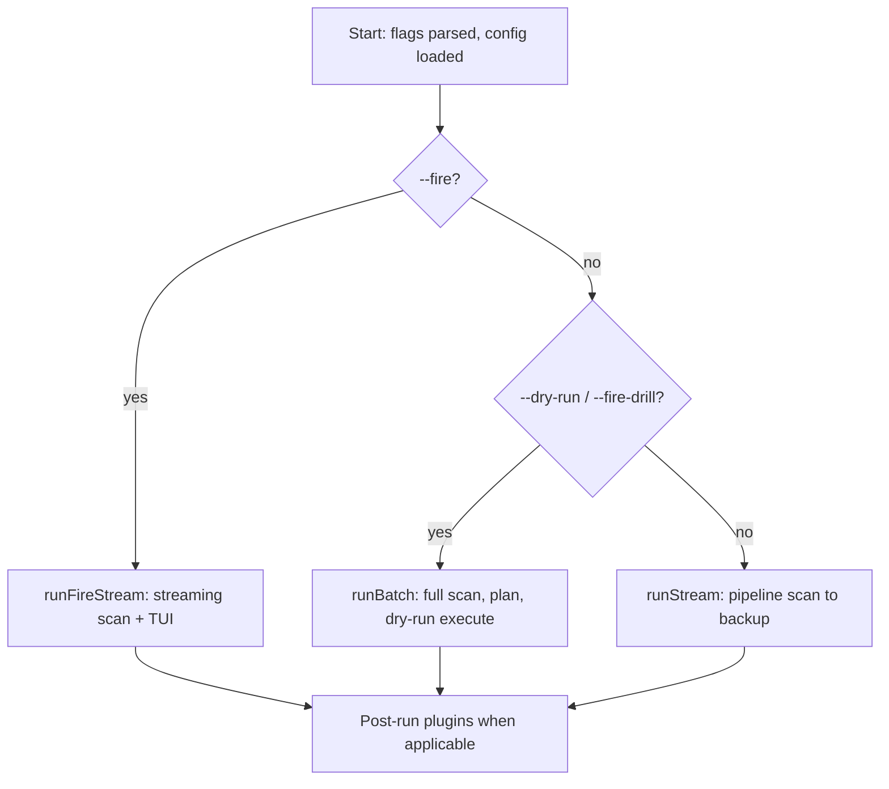
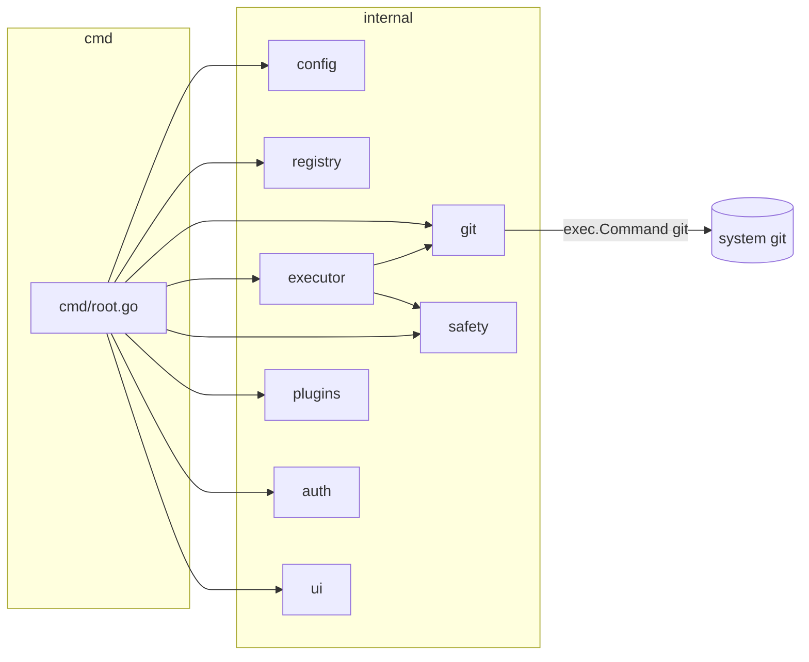
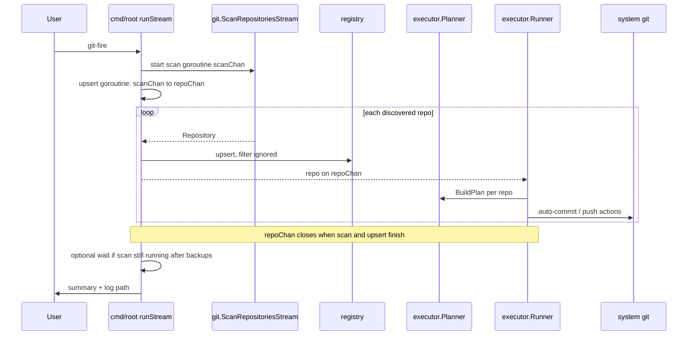
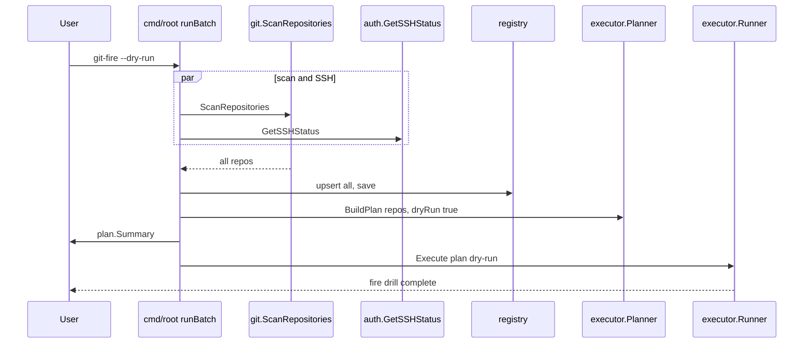
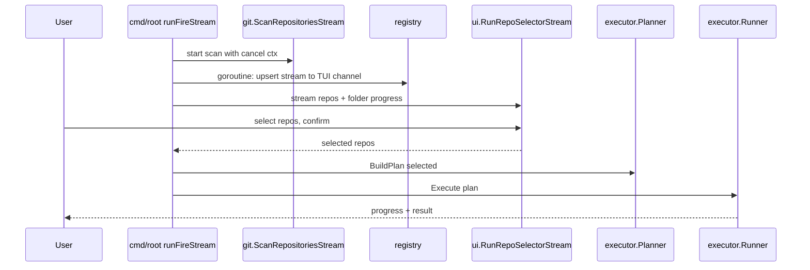
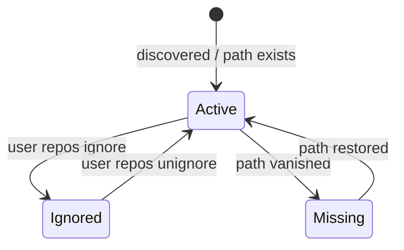
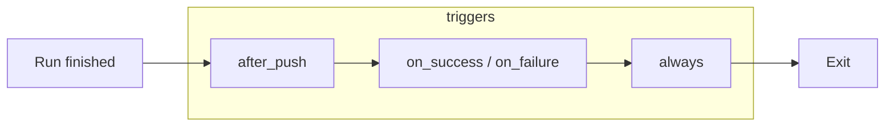

# Architecture diagrams (Mermaid)

Visual reference for how `git-fire` routes work and how major subsystems interact. Source of truth for behavior remains the code and [GIT_FIRE_SPEC.md](../GIT_FIRE_SPEC.md); treat these diagrams as orientation aids.

GitHub renders Mermaid in Markdown. For local preview, use an editor with a Mermaid preview or [mermaid.live](https://mermaid.live).

## CLI routing (after config and registry load)

`cmd/root.go` picks one of three orchestration paths from flags:

## Internal package map

High-level layering (business logic lives under `internal/`; `cmd/` wires flags and I/O):

## Default live run: scan → registry → streamed backup

The default path pipelines discovery and execution so the first discovered repo can be planned and pushed before the filesystem walk finishes. `ExecuteStream` blocks until `repoChan` closes (scan plus upsert complete).

## Dry-run (`--dry-run`): batch scan, then plan

Dry-run collects the full repository list first, builds one plan, prints a summary, and runs the executor in dry-run mode (including secret checks where applicable). No remote mutations.

## TUI mode (`--fire`): progressive discovery

The scanner runs in the background; repositories stream through registry upsert into the Bubble Tea selector. After the user confirms selection, planning and execution follow the same planner/runner path as a non-streaming live run (not `ExecuteStream`).

## Registry state (conceptual)

Entries persist by absolute path. Only **ignored** repos are excluded from backup by default; missing paths can be marked when validated.

## Post-run plugins

After a successful or failed run (and not on user abort, dry-run, or no-op), enabled command plugins run by trigger: `after_push`, then success/failure-specific, then `always`. Failures are logged and do not fail the CLI run.

See [PLUGINS.md](../PLUGINS.md) for configuration and extension points.
