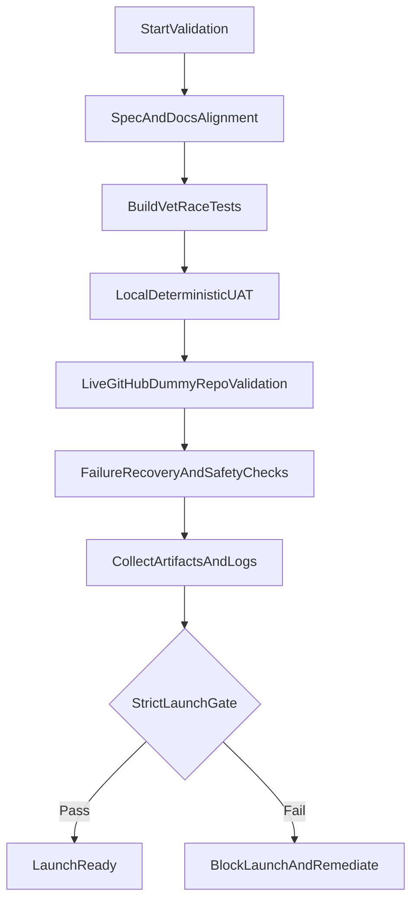

# Git-Fire Final Validation Plan

## Goal

Execute one last, strict validation round before public launch, proving core behavior in both deterministic local fixtures and real GitHub conditions using only disposable dummy repos.

## Scope (Confirmed)

- Strict launch gate: no critical/high failures allowed.
- Validation surfaces:
  - Local/offline deterministic validation.
  - Live GitHub validation using newly created dummy repos only.
- Dummy repo safety rule:
  - Create and use only prefixed test repos (e.g., `git-fire-val-*`).
  - Never modify/delete any pre-existing repos.
  - Keep dummy repos after validation for audit trail.

## Source-of-Truth Inputs

- Product docs/spec and behavior references:
  - [README](../README.md)
  - [GIT_FIRE_SPEC](../GIT_FIRE_SPEC.md)
  - [Requirements Validation](REQUIREMENTS_VALIDATION.md)
  - [UAT Bugs/Resolutions](UAT_BUGS.md)
  - [OSS Publish Plan](OSS_PUBLISH_PLAN.md)
- Existing UAT harness:
  - [scripts/uat_test.sh](../scripts/uat_test.sh)
- Build/test/quality gates:
  - [Makefile](../Makefile)
  - [CI workflow](../.github/workflows/ci.yml)

## Validation Architecture

## Phase Plan

### Phase 1: Baseline Integrity + Static Gates

- Verify docs/spec alignment vs current implementation for critical paths only (auto-commit, conflict strategy, push modes, registry behavior, safety warnings).
- Run required static/quality gates:
  - `make build`
  - `make lint`
  - `make test-race`
- Record command outputs and durations in validation notes.

### Phase 2: Deterministic Local UAT (No Network)

- Execute full [scripts/uat_test.sh](../scripts/uat_test.sh) suite.
- Validate each scenario family:
  - Dirty staged/unstaged behavior.
  - Conflict handling and backup branch behavior.
  - Multi-branch push semantics (`push-known-branches`, `push-all`).
  - Dry-run and `--skip-auto-commit` integrity.
  - No-remote robustness.
- Cross-check failures against [UAT_BUGS.md](UAT_BUGS.md) to detect regressions vs fixed issues.

### Phase 3: Live GitHub Dummy-Repo Validation

- Safety-first preparation:
  - Enumerate existing repos and freeze baseline list (no-touch reference).
  - Define unique prefix namespace: `git-fire-val-<date>-<runid>-*`.
- Create isolated dummy repos only (private preferred), including varied shapes:
  - clean repo, dirty repo, multi-branch repo, diverged/conflict repo, multi-remote-like setup (where feasible).
- Run git-fire against these fixtures and validate:
  - Expected pushes land remotely.
  - Conflict strategy creates expected fire backup branches.
  - Local-only branches behavior is explicit and documented.
  - Secret detection warnings appear when seeded test patterns are present.
- Preserve dummy repos and tag/label them for audit.

### Phase 4: Resilience, Safety, and Negative Paths

- Execute controlled failure scenarios in dummy repos:
  - auth/token/permission-denied cases.
  - non-fast-forward rejection paths.
  - partial-failure continuation behavior.
- Confirm:
  - No force-push behavior.
  - Error output is actionable and not misleading.
  - Logs are generated and sanitized as expected.

### Phase 5: Launch Gate + Sign-off Package

- Apply strict gate criteria (below).
- Produce final validation report with:
  - pass/fail matrix by scenario,
  - artifact links/paths (logs, command outputs),
  - known issues (must be none in critical/high classes),
  - launch recommendation: GO / NO-GO.

## Strict Launch Gate Criteria

- Must pass with zero critical/high findings:
  - `make build`, `make lint`, `make test-race` all green.
  - Local UAT scenarios pass or have only low-risk documented exceptions.
  - Live GitHub dummy-repo validation confirms expected behavior for commit/push/conflict/safety flows.
  - No destructive behavior observed on non-dummy repos.
- Block launch if any of the above fails.

## Evidence and Traceability

- Store all evidence under a dedicated validation artifact directory (timestamped run folder).
- Include:
  - command transcripts,
  - UAT outputs,
  - git-fire log files,
  - mapping from each requirement area to observed evidence.
- Keep dummy GitHub repos for audit and reproducibility.

## Model Recommendation

- For re-evaluating this plan and executing the full campaign, use **a more capable reasoning model** (not a speed-optimized one).
- Rationale:
  - You need high reliability across long, multi-phase workflows,
  - nuanced interpretation of failures vs expected behavior,
  - careful safety handling for live GitHub operations,
  - stronger synthesis for final GO/NO-GO decisioning.
- Practical split:
  - Use the more capable model for orchestration, failure triage, and final sign-off.
  - Use a faster model only for mechanical/repetitive substeps (log parsing, repetitive command wrappers) under supervision.
