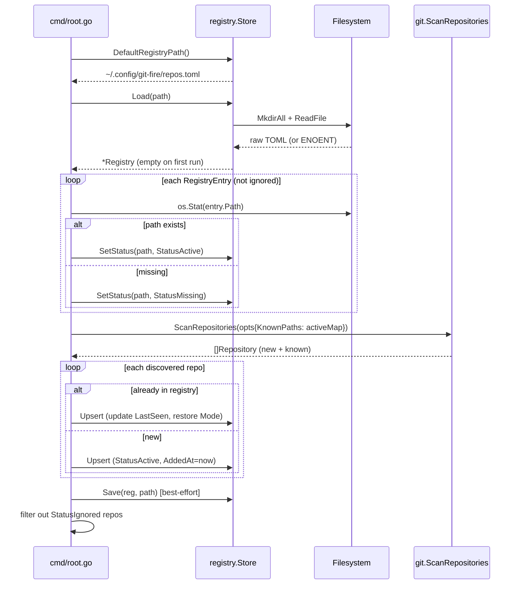
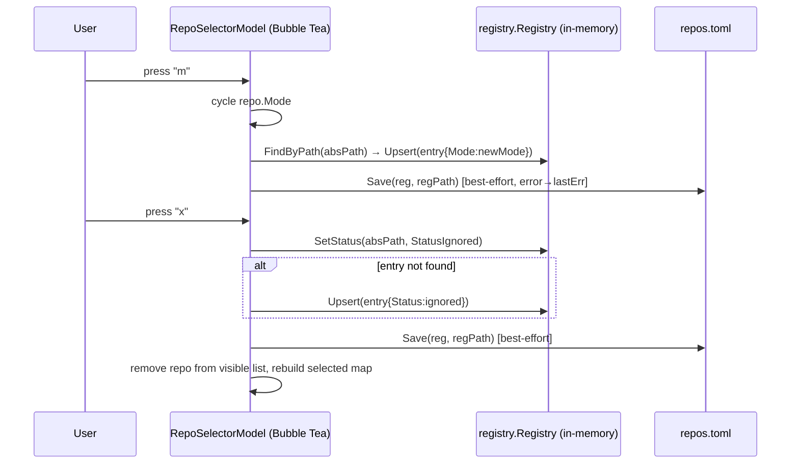
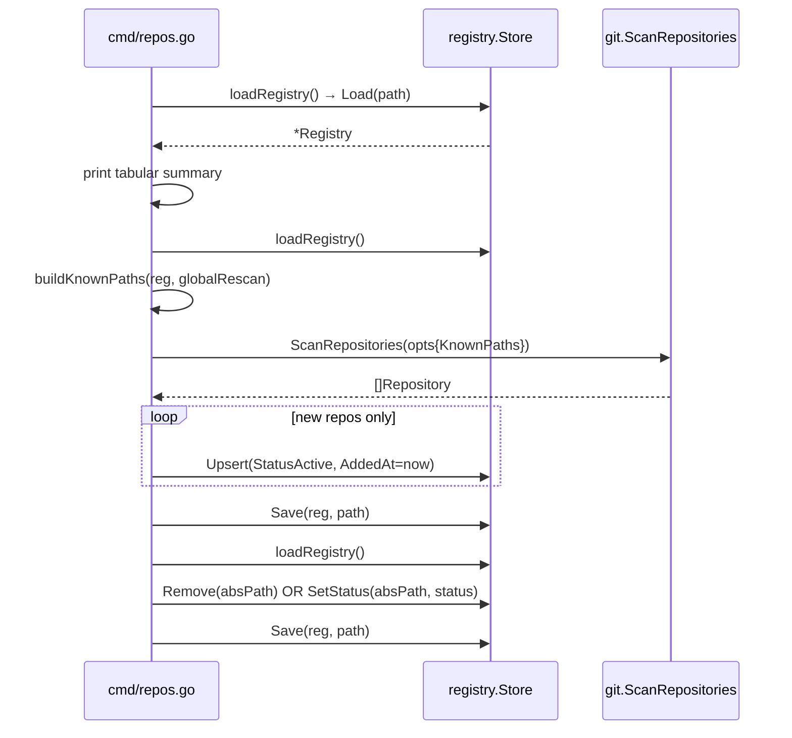
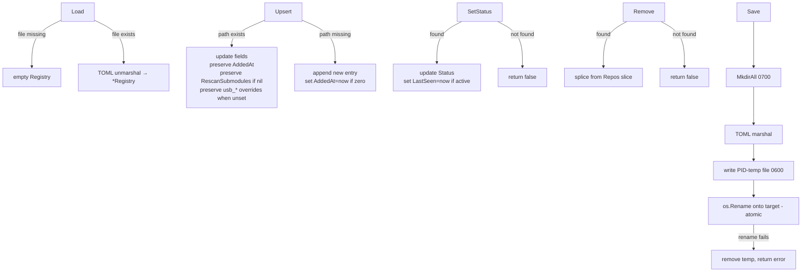

# Persistent Repository Registry

`git-fire` maintains a registry at `~/.config/git-fire/repos.toml` (next to `config.toml`) that accumulates every git repo discovered across runs. Known repos are loaded instantly at startup; the filesystem walker only descends into directories not already in the registry.

Related docs:
- quickstart and CLI usage: [../README.md](../README.md)
- full behavior spec: [../GIT_FIRE_SPEC.md](../GIT_FIRE_SPEC.md)
- docs index: [README.md](README.md)

## Architecture Diagrams

### 1. Startup Registry Flow (`runGitFire`)

### 2. TUI Write-Through (mode `m` / ignore `x`)

### 3. `git-fire repos` CLI Subcommands

### 4. Registry Store — Data Operations

## USB-related Registry Fields

Each `repos.toml` entry may include optional USB overrides:

- `usb_strategy`: per-repo strategy override (`git-mirror` or `git-clone`)
- `usb_repo_path`: destination path override relative to target repos root
- `usb_sync_policy`: per-repo sync policy (`keep` or `prune`)

When an existing repo entry is upserted, these overrides are preserved if the incoming update does not specify them.
